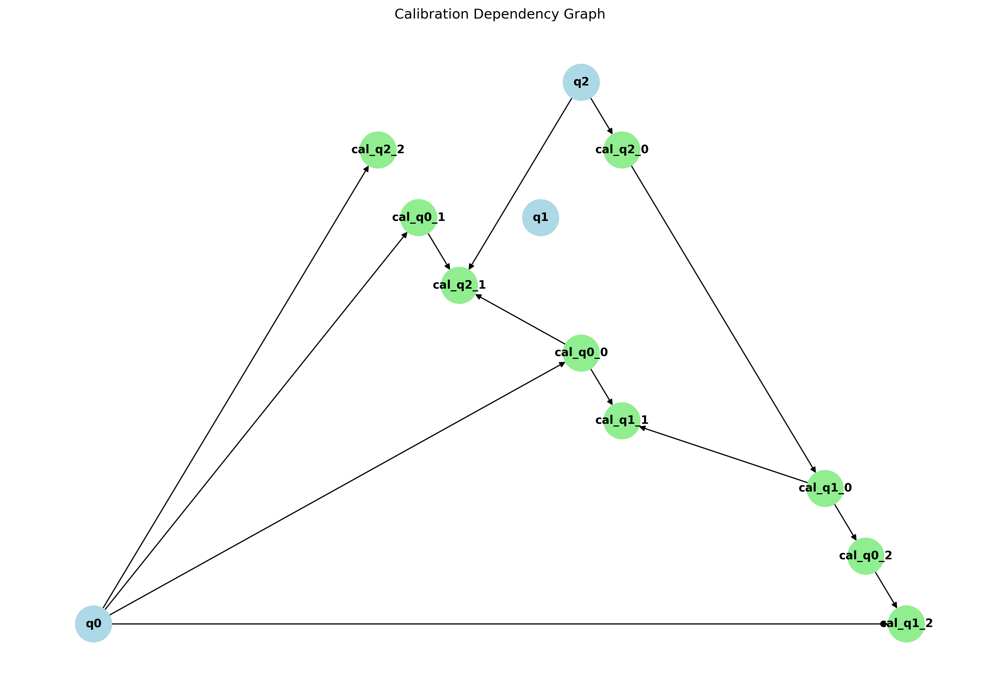

# Optimus

> This repository is the unofficial implementation of **Physical qubit calibration on a directed acyclic graph** - [arxiv.org](https://arxiv.org/abs/1803.03226)

## QubitCalGraph



QubitCalGraph is a Python class for generating, visualizing, and analyzing calibration dependency graphs for qubit systems.

### Features:

- Generate random calibration dependency graphs based on configurable parameters
- Visualize the calibration dependency graph
- Save the graph visualization to a file
- Customizable number of qubits and calibrations per qubit


### Usage

```python
from qubit_cal_graph import QubitCalGraph

# Create a new QubitCalGraph instance
graph = QubitCalGraph()

# Display the graph
graph.plot_graph()

# Save the graph to a file
graph.save_plot("images/calibration_graph.png")
```

### Configuration - `graph.yml`

QubitCalGraph uses a YAML configuration file to set various parameters.

```yaml
seed: 42            # Random seed for reproducibility
qubits: 5           # Number of qubits in the system
each_qubit_cal: 3   # Number of calibrations for each qubit
```

### Class Methods

- `__init__(self, config_path="./graph.yml")`: Initializes the QubitCalGraph instance, loads the configuration, and generates the graph.
- `generate_graph(self)`: Generates the calibration dependency graph based on the configuration.
- `plot_graph(self)`: Displays the calibration dependency graph.
- `save_plot(self, filename="calibration_graph.png")`: Saves the calibration dependency graph to a file.
